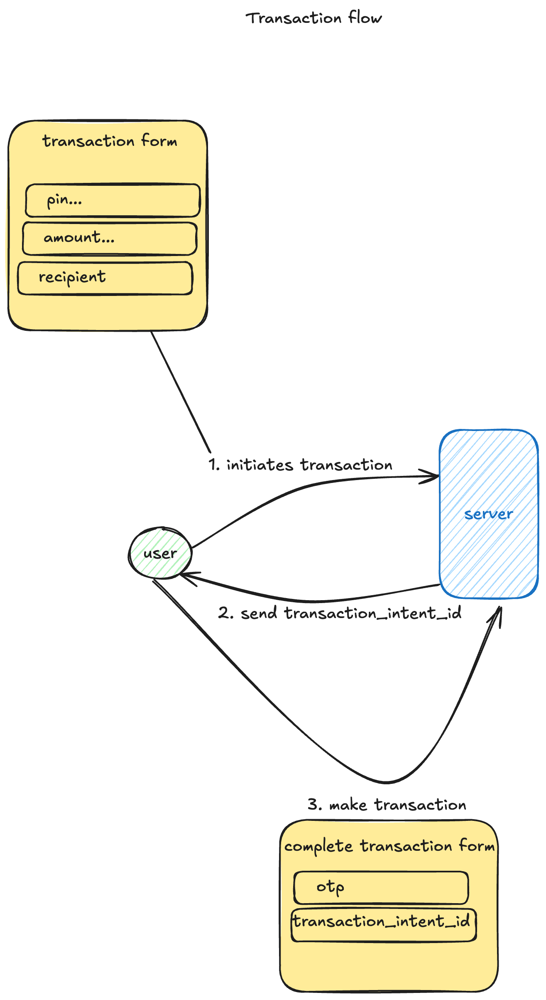

# Setup Instructions

If you don't have pnpm installed, you can replace all `pnpm` commands with `npm` or `yarn` throughout these instructions.

## Database Setup

Create a postgres docker container:

```bash
docker run --name postgres -e POSTGRES_PASSWORD=mysecretpassword -p 5432:5432 -d postgres
```

## Run the seed file

## Project Setup

1. Install dependencies:

```bash
pnpm install
```

2. Generate prisma client:

```bash
pnpm prisma generate
```

3. Sync prisma schema with database:

```bash
pnpm prisma db push
```

4. Run the seed file:

```bash
pnpm prisma db seed
```

5. Run the server:

```bash
pnpm start:dev
```

# Transactions Flow

- For User A to send money to User B they need to provide thier pin, the amount and the recipient's username.
- The server will check if the user has enough balance and if the recipient exists.
- An idempotent key is generated and sent to the user(this is used to prevent duplicate requests). A one time use key is sent to the user's email.
- The user will need to provide the one time use key to complete the transaction.
- The server will update the balance of the sender and recipient.
- The server will create a transaction record in the database.
- The server will send a confirmation email to the recipient.

## Transaction Flow Diagram




